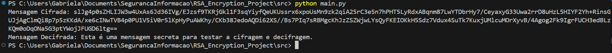

<h1 align="center">RSA Encryption and Decryption</h1>

## Project
This project demonstrates the implementation of encryption and decryption of messages using the RSA (Rivest-Shamir-Adleman) algorithm. The application provides functions to encrypt and decrypt text messages, using public and private keys to ensure security and authenticity of the data.

## Implementation
The project includes the following features:
- Key generation for RSA.
- Encryption of messages using public key.
- Decryption of messages using private key.

## Technologies Used
- **Programming Language:** Python
- **Library:** cryptography


### Comprovando a Execução do Projeto

```markdown
## Execution
<div align="center">
  
</div>

## Author
Code by Gabriela Oliveira

## Usage
```python
from cryptography.hazmat.primitives.asymmetric import rsa, padding
from cryptography.hazmat.primitives import hashes, serialization
from cryptography.hazmat.backends import default_backend
import base64

# Geração de chaves
def generate_keys():
    private_key = rsa.generate_private_key(
        public_exponent=65537,
        key_size=2048,
        backend=default_backend()
    )
    public_key = private_key.public_key()
    return private_key, public_key

# Função para cifrar a mensagem
def encrypt(message, public_key):
    ciphertext = public_key.encrypt(
        message.encode(),
        padding.OAEP(
            mgf=padding.MGF1(algorithm=hashes.SHA256()),
            algorithm=hashes.SHA256(),
            label=None
        )
    )
    return base64.b64encode(ciphertext).decode()

# Função para decifrar a mensagem
def decrypt(ciphertext, private_key):
    decoded_ciphertext = base64.b64decode(ciphertext)
    plaintext = private_key.decrypt(
        decoded_ciphertext,
        padding.OAEP(
            mgf=padding.MGF1(algorithm=hashes.SHA256()),
            algorithm=hashes.SHA256(),
            label=None
        )
    )
    return plaintext.decode()

# Função para salvar as chaves em arquivos
def save_keys(private_key, public_key):
    pem_private_key = private_key.private_bytes(
        encoding=serialization.Encoding.PEM,
        format=serialization.PrivateFormat.TraditionalOpenSSL,
        encryption_algorithm=serialization.NoEncryption()
    )
    pem_public_key = public_key.public_bytes(
        encoding=serialization.Encoding.PEM,
        format=serialization.PublicFormat.SubjectPublicKeyInfo
    )

    with open("private_key.pem", "wb") as f:
        f.write(pem_private_key)

    with open("public_key.pem", "wb") as f:
        f.write(pem_public_key)

# Função para carregar as chaves de arquivos
def load_keys():
    with open("private_key.pem", "rb") as f:
        private_key = serialization.load_pem_private_key(
            f.read(),
            password=None,
            backend=default_backend()
        )

    with open("public_key.pem", "rb") as f:
        public_key = serialization.load_pem_public_key(
            f.read(),
            backend=default_backend()
        )

    return private_key, public_key

# Exemplo de uso
private_key, public_key = generate_keys()
save_keys(private_key, public_key)

mensagem = "Esta é uma mensagem secreta."

# Cifrar a mensagem
mensagem_cifrada = encrypt(mensagem, public_key)
print(f"Mensagem Cifrada: {mensagem_cifrada}")

# Decifrar a mensagem
mensagem_decifrada = decrypt(mensagem_cifrada, private_key)
print(f"Mensagem Decifrada: {mensagem_decifrada}")
